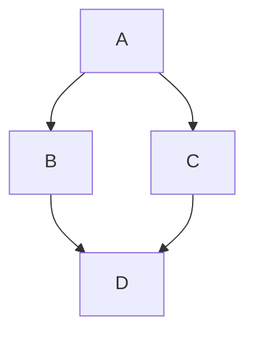

# MDX Showcase

This post is a full-spectrum content check for the blog theme. It exercises standard Markdown, Docusaurus blocks, and custom MDX components in one place.

<!-- truncate -->

## Text

Paragraph text should stay readable in both dark and light terminal themes. Inline code like `npm run build` and links like [Docusaurus](https://docusaurus.io/) should keep the neon accent without overwhelming the page.

> This quote block is here to verify border styling, spacing, and contrast.

## Lists

- Bullet list item
- Another item with **bold text**
- Another item with _emphasis_

1. Ordered list item
2. Ordered list item
3. Ordered list item

- [x] Completed task
- [ ] Pending task

## Code

```py title="fibo.py"
def fib(n: int) -> int:
    if n < 0:
        raise ValueError("n must be non-negative")
    if n < 2:
        return n
    return fib(n - 1) + fib(n - 2)
```

```haskell title="fibo.hs"
fib :: Int -> Integer
fib n
  | n < 0     = error "n must be non-negative Int"
  | otherwise = fibs !! n
  where
    fibs = 0 : 1 : zipWith (+) fibs (tail fibs)

main :: IO ()
main = print (fib 10)
```



## Table

| Layer | Status | Notes |
| --- | --- | --- |
| Theme | Online | Dual dark/light terminal skins |
| Blog | Online | Homepage is blog-first |
| Prism | Online | Code blocks look like terminal windows |

## Admonitions

:::note
This is a note block.
:::

:::tip
Use the color-mode toggle in the navbar to switch between dark terminal and white terminal themes.
:::

:::warning
Subtle glow effects look best when spacing and contrast stay restrained.
:::

## Math

$$
\frac{1}{\pi} = \frac{2\sqrt{2}}{9801} \sum_{k=0}^{\infty}
\frac{(4k)! (1103 + 26390k)}{(k!)^4 396^{4k}}
$$

$$
\int_0^1 x^2 dx = \frac{1}{3}
$$

## HTML

<div style={{ padding: '0.8rem 1rem', border: '1px dashed var(--ifm-color-primary)', borderRadius: '12px' }}>
  Raw HTML/JSX blocks still render inside the terminal theme.
</div>

## Details

<Details summary={<>Open hidden notes</>}>
  <>
    <p>This content sits inside a native disclosure block.</p>
    <p>It is useful for logs, spoilers, and collapsed reference sections.</p>
  </>
</Details>

## Terminal Frame

<TerminalFrame title="session.log" prompt="visitor@node:~$">
  <p>Connected to the neon archive.Theme verification: success.</p>
</TerminalFrame>
